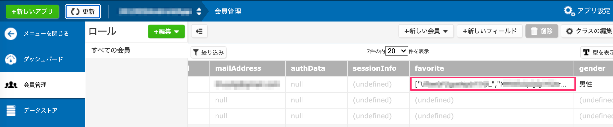
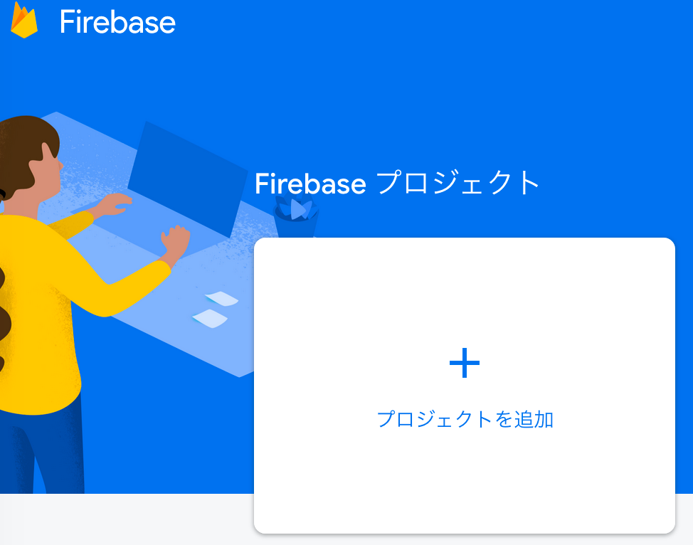
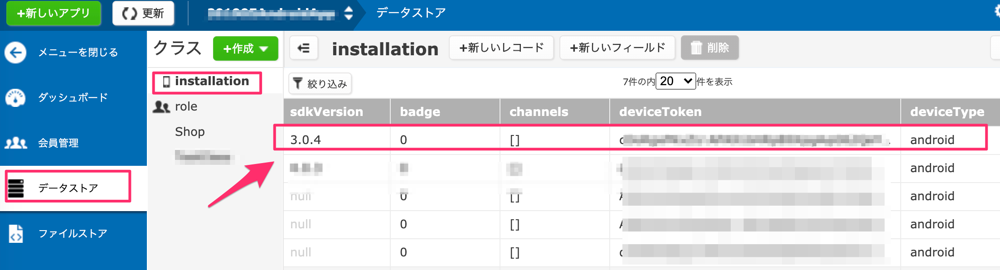

name: inverse
layout: true
class: center, middle, inverse
---
# <span style="font-size: 30%">【Android編】ニフクラmobile backend レベルアップセミナー</span><br>__クーポン配信アプリ<br>を作ろう！__</span>

@ncmbadmin

.footnote[
20160817 Created (202006 Updated)
]
---
layout: false
## 事前準備
ニフクラmobile backendのアカウント登録がお済みでない方は、<br>
[ホームページ](https://mbaas.nifcloud.com/about.htm)右上にある「無料登録」ボタンをクリックして、<br>
アカウント登録を実施してください


---
## 事前準備
登録について以下のどちらかのアカウントで登録を行ってください
- SNS ID（クレジットカード払い）の登録　※無料から利用可能
  - お持ちのSNSアカウントログインで、登録することができます。対応するSNSアカウントはFacebook、Twitter、Googleです。
  - 登録は[こちら](https://console.mbaas.nifcloud.com/signup)
  - ※海外からの利用はこちらの登録方法をオススメいたします。（次のページで説明）
- ニフクラID（請求書払い）として登録　※Expertプラン以上
  - 先にニフクラIDを取得することが必要です。
  - 登録は[こちら](https://sso.nifcloud.com/auth/realms/nifcloud/protocol/openid-connect/registrations?client_id=user-registration&response_type=code&redirect_uri=%2Fcomp-registration.html&entry_code=N00000470100)

---
## 事前準備（海外からの利用案内）

- サービスの英語サイトはこちらとなっています
https://mbaas.nifcloud.com/en/
- 管理画面は「日本語・英語・中文」の言語を対応しております。
- 言語を表示する際、以下のように行ってください。


---
## 動作環境

本セミナーのプロジェクトは以下の環境で動作を確認しております。
* Android Studio ver3.6.1
* Android OS ver.9 (実機)
* ニフクラmobile backend Android SDK ver.3.0.4

---
## 今回のハンズオンセミナーについて
### セミナーの形式

- ３回分けて機能を実施していきます。
- 講義形式で説明と演習を繰り返してアプリを作成します。
- 途中で動作確認タイムと休憩タイム取りながら進み、全体進捗を確認させていただきます。
- 質疑応答は随時行います。
- （英語資料をご覧の方へ）事前にお詫びですが、資料などなるべく翻訳を行っていますが、
アプリ画面や管理画面や機能は日本語のままになっているところがあります。
随時その場で補足して翻訳を対応しますが、何卒よろしくお願いします。

---
## ハンズオンの概要
### 作成するアプリについて

* クーポン配信アプリをイメージした「mBaaS Shop List」アプリの作成を通して、mBaaSの機能を理解していきます
* mBaaSの連携部分をコーディングし、アプリを完成させ、次の内容を実現していきます
 * 会員登録をするとお店情報を見ることができます
 * お店のお気に入り登録ができ、お気に入り登録をしたお店からプッシュ通知で届きます
 * 性別や都道府県限定のプッシュ通知ができます
 * お店からのプッシュ通知でクーポンを直接配信することができます
 * 決まった時間に通知を出すようにプッシュ通知を仕掛けることができます

---
## ハンズオンの概要
### 作成するアプリについて

.center[

]

---
## ニフクラ mobile backendとは
### サービス紹介

* スマホアプリで汎用的に実装される機能を、クラウドサービスとして提供しているサービスです
 * 通称「mBaaS」と呼びます
* 対応機能一覧はこちらです。

.center[

]

---
## 今回のハンズオンセミナーについて
### 学ぶ内容：データストア機能活用

「mBaaS Shop List」アプリの作成を通して、お店の情報、お気に入り情報を
データストア機能を利用して、データ登録、表示、管理を行います。
これらの機能は会員機能を用いて実装を行います。

---
## 今回のハンズオンセミナーについて
### 学ぶ内容：会員管理機能活用

「mBaaS Shop List」アプリの作成を通して、ユーザログイン、ログアウトの実装、
ユーザと紐づいて、お気に入り登録、表示、管理を行います。これらの機能は会員機能を用いて
実装を行います。

---
## 今回のハンズオンセミナーについて
### 学ぶ内容：ファイルストア機能活用

「mBaaS Shop List」アプリの作成を通して、お店の表示する画像、セール情報のPR画像の管理は
ファイルストアで行います。

---
## 今回のハンズオンセミナーについて
### 学ぶ内容：プッシュ通知応用①

「mBaaS Shop List」アプリの作成を通して、アクティブユーザー率を上げる<br>
効率的なプッシュ通知の組み込み方を学びます

.center[

]

---
## 今回のハンズオンセミナーについて
### 学ぶ内容：プッシュ通知応用②

「mBaaS Shop List」アプリの作成を通して、アクティブユーザー率を上げる<br>
効率的なプッシュ通知の組み込み方を学びます<br>

.center[

]

---
## 今回のハンズオンセミナーについて
### 学ぶ内容：プッシュ通知応用③

「mBaaS Shop List」アプリの作成を通して、アクティブユーザー率を上げる<br>
効率的なプッシュ通知の組み込み方を学びます<br><br>

.center[

]

---
## ニフクラ mobile backendとは
### Android SDKの特徴

* SDKのインストールが必要です
 * 今回は実装済み
 * 参考：[クイックスタート](https://mbaas.nifcloud.com/doc/current/introduction/quickstart_android.html)
* SDKの初期化処理が必要です
 * MainActivity.javaの冒頭に次のコードを追記して、インストールしたSDKを読み込みます

```java
import com.nifcloud.mbaas.core.NCMB;
```

 * アプリの初期化はこちらになります。

```java
NCMB.initialize(this.getApplicationContext(),"YOUR_APPLICATION_KEY","YOUR_YOUR_CLIENT_KEY");
```

---
## ニフクラ mobile backendとは
### Android SDKの特徴

* サーバへリクエスト処理には、__同期処理__ と __非同期処理__ があります

```java

// 例）保存の場合
/* 同期処理 */

NCMBObject obj = new NCMBObject("SaveObjectTest");
obj.put("key", "value");
obj.save();

```

---
## ニフクラ mobile backendとは
### Android SDKの特徴

* サーバへリクエスト処理には、__同期処理__ と __非同期処理__ があります

```java
/* 非同期処理 */

NCMBObject obj = new NCMBObject("SaveObjectTest");
obj.put("key", "value");
obj.saveInBackground(new DoneCallback() {
    @Override
    public void done(NCMBException e) {
        if (e != null) {
            //エラー発生時の処理
        } else {
            //成功時の処理
        }
    }
});

```

---
## ニフクラ mobile backendとは
### Android SDKの特徴

* 同期処理と非同期処理
 * 同期処理はその処理が完了するまで、次の処理が実行されません
 * 非同期処理はバックグラウンドで処理を実行し、次の処理を実行します DoneCallback()にて処理後の実装を事前に指定できます


---
## ハンズオンの流れ

__<font color="#49a7e5" size="5">第１回&nbsp;</font><font size="6">「mBaaS Shop List」アプリを作ろう！</font>__

.size_large[
1. ハンズオンの準備
1. 会員管理機能の作成
1. Shop情報の設定
]

__<font color="#49a7e5" size="5">第２回&nbsp;</font><font size="6">お気に入り機能とプッシュ通知準備！</font>__

.size_large[
1. お気に入り機能の作成
1. プッシュ通知の準備
]

__<font color="#49a7e5" size="5">第３回&nbsp;</font><font size="6">プッシュ通知を送ろう！</font>__
.size_large[
1. プッシュ通知を送信：セグメント配信
1. プッシュ通知を送信：リッチプッシュ
1. プッシュ通知を送信：ペイロード
]

---
layout: true
class: center, middle, inverse_sub
---
#「mBaaS Shop List」<br>アプリを作ろう！

.size_large[
＜第1回＞
]

---
layout: true
class: center, middle, inverse
---
# 1.ハンズオンの準備

---
layout: false
## ハンズオンの準備
### プロジェクトをダウンロード

下記リンクをクリックして、ZIPファイルでダウンロードしてください▼<br>
.size_medium[
　　　 __[AndroidAdvancePush](https://github.com/NIFCLOUD-mbaas/AndroidAdvancePush/archive/handson.zip)__
]

* zipファイルを展開します。
* AndroidStudioで先ほどダウンロードしたプロジェクトを開いてください。

.center[

]

---
layout: false
## ハンズオンの準備
### プロジェクトを準備

* AndroidStudioでプロジェクトのビューを調整します。
  - 左上のビューオプション項目で[Android]を選択します。

.center[

]

---
layout: false
## ハンズオンの準備
### プロジェクトを準備

* AndroidStudioでプロジェクトのファイル構成を確認します。
  - 以下のように処理のファイルが入っていることをご確認ください。

.center[

]

---
## ハンズオンの準備
### プロジェクトにあらかじめ実施していること

* mBaaS Android SDK v.3.0.4のインストール, build.graddleの設定, AndroidManifestの設定は実装済み
* build.gradle
```
buildscript {
    repositories {
        jcenter()
        google()
    }
    dependencies {
        classpath 'com.android.tools.build:gradle:3.2.0'
        classpath 'com.google.gms:google-services:4.3.3'
    }
}

allprojects {
    repositories {
        jcenter()
        google()
    }
}
```

---
## ハンズオンの準備
### プロジェクトにあらかじめ実施していること


* app/build.gradle
```
repositories {
    maven {
        url 'https://maven.google.com'
    }
}
```

```
dependencies {
    implementation 'com.google.code.gson:gson:2.3.1'
    <<省略>>
    api files('libs/NCMB.jar')
}
```

---
## ハンズオンの準備
### プロジェクトにあらかじめ実施していること

* AndroidManifest.xml

```
<uses-permission android:name="android.permission.INTERNET" />
<uses-permission android:name="android.permission.ACCESS_NETWORK_STATE" />

<<省略>>

<activity
    android:name=".MainActivity"
    android:label="@string/app_name"
    android:theme="@style/AppTheme.NoActionBar" >
    <intent-filter>
        <action android:name="android.intent.action.MAIN" />
        <category android:name="android.intent.category.LAUNCHER" />
    </intent-filter>
</activity>
<activity android:name=".LoginActivity" />
<activity android:name=".SignupActivity" />
<activity android:name=".RegisterActivity" />
<activity android:name=".ShopActivity" />
<activity android:name=".FavoriteActivity" />
<activity android:name=".InfoActivity" />

```

---
## ハンズオンの準備
### プロジェクトにあらかじめ実施していること

* mBaaSとの連携以外の処理のコーディング
 * アプリのデザインを`layoutフォルダー内ファイル`で作成し、処理は画面ごと`Activityのファイル`にコーディングしています

.center[

]

---
## ハンズオンの準備
### mBaaSの準備

* [mBaaS](https://mbaas.nifcloud.com)にログインしてアプリを作成します
* アプリの作成画面ではアプリ名を入力し、「新規作成」とクリックします
* アプリが正常に作成されましたら、新アプリの「アプリケーションキー」と「クライアントキー」（APIキー）を表示されます。
後ほど使いますので、コピーペーストでメモを取ってください。


---
## ハンズオンの準備
### APIキーの設定とSDKの初期化

* `MainActivity.java`を開きます
* `onCreate()`メソッド内に以下の処理をコメントの下に追記します[ライブラリインポート処理は実装済み]

```java
//**************** 【mBaaS/Initialization: APIキーを指定する】***************
NCMB.initialize(this.getApplicationContext(),"YOUR_APPLICATION_KEY","YOUR_CLIENT_KEY");
```

---
## ハンズオンの準備
### APIキーの設定とSDKの初期化

* 初期化処理の「`YOUR_APPLICATION_KEY`」，「`YOUR_CLIENT_KEY`」の部分をアプリ作成時に発行されたAPIキーに書き換えてください。
 * 先ほどメモされていない方は、APIキーを再度確認するには、mBaaSの管理画面から「アプリ設定」→「基本」にありますので、そちらで確認することが可能です。

.center[

]

---
layout: true
class: center, middle, inverse
---
# 2.会員管理機能の作成

---
layout: false
## 会員管理機能の作成
### mBaaSの設定

* mBaaSでは、「ユーザ名/パスワード認証」、「メールアドレス/パスワード認証」など会員管理機能として、利用可能ですが、
今回のハンズオンでは「メールアドレス/パスワード認証」機能を利用します。
* 会員管理設定の「メールアドレス/パスワード認証」を許可します。

.center[

]


---
## 会員管理機能の作成

### 会員管理①：会員登録用メールを要求する

.center[

]

---
## 会員管理機能の作成
### 会員管理①：会員登録用メールを要求する

* `SignupActivity.java`を開きます。
* `doSignupByEmail()`メソッドを開きます。以下のコメントが書かれているところを開きます。
```java
//**************** 【mBaaS/User①】: 会員登録用メールを要求する】***************
```
* 会員登録処理は以下のように実装コードを追記してください。
```java
//**************** 【mBaaS/User①】: 会員登録用メールを要求する】***************
String email = _signupEmail.getText().toString();
NCMBUser.requestAuthenticationMailInBackground(email, new DoneCallback() {
     @Override
     public void done(NCMBException e) {
         if (e != null) {
             // 会員登録用メールの要求失敗時の処理
         } else {
             // 会員登録用メールの要求成功時の処理
         }
     }
 });
```

---
## 会員管理機能の作成
### 会員管理①：会員登録用メールを要求する[実装済み]

* それぞれ処理を追記してください

```java
// 会員登録用メールの要求失敗時の処理
new AlertDialog.Builder(SignupActivity.this)
        .setTitle("Notification from NIFCLOUD")
        .setMessage("Send failed! Error:" + e.getMessage())
        .setPositiveButton("OK", null)
        .show();
```

```java
// 会員登録用メールの要求成功時の処理
new AlertDialog.Builder(SignupActivity.this)
        .setTitle("Notification from NIFCLOUD")
        .setMessage("メール送信完了しました! メールをご確認ください。")
        .setPositiveButton("OK", new DialogInterface.OnClickListener() {
            public void onClick(DialogInterface dialog, int which) {
                //Login画面遷移します
                Intent intent = new Intent(getApplicationContext(), LoginActivity.class);
                startActivityForResult(intent, REQUEST_RESULT);
            }
        })
        .show();
```
---
## 会員管理機能の作成
### 会員管理②：メールアドレスとパスワードでログイン

.center[

]

---
## 会員管理機能の作成
### 会員管理②：メールアドレスとパスワードでログイン

* `LoginActivity.java`を開きます。
* `doLogin()`メソッドを開きます。以下のコメントが書かれているところを開きます。
```java
//**************** 【mBaaS/User②】: メールアドレスとパスワードでログイン】***************
```
* ログイン処理は以下のように追記してください。

```java
//**************** 【mBaaS/User②】: メールアドレスとパスワードでログイン】***************
String email = _loginEmail.getText().toString();
String password = _loginPassword.getText().toString();

NCMBUser.loginWithMailAddressInBackground(email, password, new LoginCallback() {
    @Override
    public void done(NCMBUser user, NCMBException e) {
        if (e != null) {
            //ログインに失敗した場合の処理
        } else {
            //ログインに成功した場合の処理
        }
    }
});
```

---
## 会員管理機能の作成
### 会員管理②：メールアドレスとパスワードでログイン<

* それぞれ処理を追記してください

```java
//ログインに失敗した場合の処理
new AlertDialog.Builder(LoginActivity.this)
        .setTitle("Notification from NIFCLOUD")
        .setMessage("Login failed! Error:" + e.getMessage())
        .setPositiveButton("OK", null)
        .show();
```

---
### 会員管理②：メールアドレスとパスワードでログイン

* それぞれ処理を追記してください（続き）

```java
//ログインに成功した場合の処理
common.currentUser = NCMBUser.getCurrentUser();
AlertDialog show = new AlertDialog.Builder(LoginActivity.this)
        .setTitle("Notification from NIFCLOUD")
        .setMessage("ログイン成功")
        .setPositiveButton("OK", new DialogInterface.OnClickListener() {
            public void onClick(DialogInterface dialog, int which) {
                String nickname = common.currentUser.getString("nickname");
                if (nickname != null && !nickname.isEmpty() && !nickname.equals("null")) {
                    //メイン画面遷移します
                    Intent intent = new Intent(getApplicationContext(), MainActivity.class);
                    startActivityForResult(intent, REQUEST_RESULT);
                } else {
                    //初期ログイン会員登録画面遷移します
                    Toast.makeText(LoginActivity.this, "Register user information
                    for the first time!", Toast.LENGTH_LONG).show();
                    Intent intent = new Intent(getApplicationContext(),
                    RegisterActivity.class);
                    startActivityForResult(intent, REQUEST_RESULT);
                }
            }
        })
        .show();
```

---
## 会員管理機能の作成
### 動作確認(1)ログインをしてみましょう

* ここではシュミレーター・実機にビルドし、動作確認を行います
* ログイン画面で「会員登録」をタップします
* 会員登録画面でメールアドレスを入力し「登録メールを送信」をタップします
 * メッセージを確認してください
 * エラーが発生したらここを見てください。
 [エラーコード一覧](https://mbaas.nifcloud.com/doc/current/rest/common/error.html#REST%20APIのエラーコードについて)

---
## 会員管理機能の作成
### 動作確認(1)ログインをしてみましょう

.center[

]

---
## 会員管理機能の作成
### 動作確認(1)ログインをしてみましょう

* 会員登録メールが届くので、パスワード設定します

.center[

]

---
## 会員管理機能の作成
### 動作確認(1)ログインをしてみましょう

* 再びログイン画面に戻り「メールアドレス」と「パスワード」でログインします。正常にログインされることを確認してください。
 * ログを確認してください。
* また、mBaaSの管理画面にて、登録されたユーザー情報も確認してください。
 * 管理画面の右側のタブに「会員管理」を選択し、「すべての会員」を選択します。
 * ユーザー一覧にてユーザーが登録されました

.center[

]
.footnote[
[エラーコード一覧](https://mbaas.nifcloud.com/doc/current/rest/common/error.html#REST%20APIのエラーコードについて)
]

---
## 会員管理機能の作成
### コード解説(1)ログインをしてみましょう

* 会員登録用メールを要求する為に、Android SDKが提供している以下のメソッドを利用して、APIリクエストを実施します。
```java
NCMBUser.requestAuthenticationMailInBackground(email, DoneCallback());
```
* emailで渡されたメールアドレスにデフォルト会員登録メールフォーマットが送られます（今回日本語のままになってしまいますが、メールフォーマット、ドメインはカスタマイズ可能）

---
## 会員管理機能の作成
### コード解説(1)ログインをしてみましょう

* 会員登録が完了しましたら、今度会員ログインを実施します。ログインを実施する為に、Android SDKが以下のメソッドを利用して、
ログインするAPIリクエストを実施します。
```java
NCMBUser.loginWithMailAddressInBackground(email, password, new LoginCallback());
```
* パラメタとしてはemail, passwordは入力フォームから受け取って、メソッド内にリクエストを生成し、サーバに通信実施します。
サーバ側から、結果が返却された場合、LoginCallback()にて、NCMBException判断で正常・エラーにてパターン処理を実施しています。

---
## 会員管理機能の作成
### 会員管理③：ユーザー情報更新

* ログインした後、初めてログインの場合、以下のようにユーザの属性を登録する画面が出てきます。
* ユーザ情報を登録処理をこれから実施していきます。
.center[

]

---
## 会員管理機能の作成
### 会員管理③：ユーザー情報更新


* `RegisterActivity.java`を開きます
* `doRegister()`を開きます
* 初回のみ表示されるユーザー情報登録画面に入力した情報をmBaaSのユーザー情報に追加する処理を実装します
* コメントの下にコードを追記していきます

```java
//**************** 【mBaaS/User③: ユーザー情報更新】***************


```

* かなり下の方にありますので、ご注意ください。

---
## 会員管理機能の作成
### 会員管理③：ユーザー情報更新

* 追記するコードは以下となります。

```java
//**************** 【mBaaS/User③: ユーザー情報更新】***************
common.currentUser.put("nickname", nickname);
common.currentUser.put("prefecture", prefecture);
common.currentUser.put("gender", selectedGender);
common.currentUser.put("favorite",list);

common.currentUser.saveInBackground(new DoneCallback() {
    @Override
    public void done(NCMBException e) {
        if (e != null) {
            // 更新失敗時の処理

        } else {
            // 更新成功時の処理

        }
    }
});

```

---
## 会員管理機能の作成
### 会員管理③：ユーザー情報更新

* それぞれ処理を追記します

```java
// 更新失敗時の処理
new AlertDialog.Builder(RegisterActivity.this)
        .setTitle("Notification from NIFCLOUD")
        .setMessage("Save failed! Error:" + e.getMessage())
        .setPositiveButton("OK", null)
        .show();
```

```java
// 更新成功時の処理
new AlertDialog.Builder(RegisterActivity.this)
       .setTitle("Notification from NIFCLOUD")
       .setMessage("保存成功しました! 入力ありがとうございます")
       .setPositiveButton("OK", new DialogInterface.OnClickListener() {
           public void onClick(DialogInterface dialog, int which) {
               Intent intent = new Intent(getApplicationContext(), MainActivity.class);
               startActivityForResult(intent, REQUEST_RESULT );
           }
       })
       .show();
```
--
## 会員管理機能の作成
### 会員管理③：ユーザー情報更新

* これでユーザー情報更新の実装の準備は完了しました。
* 動作確認については次のステップ「Shop情報の設定」の実装が完了しましたら、合わせて行いましょう。
* 次のステップに進みます。

---
layout: true
class: center, middle, inverse
---
# 3.Shop情報の設定

---
layout: false
## Shop情報の設定
### mBaaSにShop情報を用意する（データストア）

* ニフクラ mobile backendの管理画面から「データストア」を開き、「＋作成▼」ボタンをクリックし、「インポート」をクリックします
* クラス名に「__Shop__」と入力します(Sが大文字なのでご注意ください！)
* ダウンロードしたサンプルプロジェクトにあるSettingフォルダ内の「__Shop.json__」を選択してアップロードします

.center[

]

---
## Shop情報の設定
### mBaaSにShop情報を用意する（データストア）

こんな感じでインポートされます

.center[

]

---
## Shop情報の設定
### mBaaSにShop情報を用意する（ファイルストア）

* ニフクラ mobile backendの管理画面から「ファイルストア」を開き、「↑アップロード」ボタンをクリックします
* ダウンロードしたサンプルプロジェクトにあるSettingフォルダ内の「icon」「Shop」「Sale」内にあるファイルをすべてをアップロードします

.center[

]

---
## Shop情報の設定
### mBaaSにShop情報を用意する（ファイルストア）

* こんな感じでアップロードされます

.center[

]

---
## Shop情報の設定
### データストア：「Shop」クラスのデータを取得

* まず、データストアの処理を実装していきます。
* `MainActivity.java`を開きます
* `doLoadShop()`を開きます
* インポートしたShopクラスのデータを取得する処理を実装します
  - コメントの下にコードを追記していきます

```java
//**************** 【mBaaS/Shop①: 「Shop」クラスのデータを取得】***************


```

---
## Shop情報の設定
### データストア：「Shop」クラスのデータを取得

* 追記するコードはこちらです。

```java
//**************** 【mBaaS/Shop①: 「Shop」クラスのデータを取得】***************
// 「Shop」クラスのクエリを作成
NCMBQuery<NCMBObject> query = new NCMBQuery<>("Shop");
//データストアからデータを検索
List<NCMBObject> results = query.find();
//グローバル変数を更新する
common.shops = results;
ListView lv = (ListView) findViewById(R.id.lstShop);
lv.setAdapter(new ShopListAdapter(this, results));
```


---
## Shop情報の設定
### ファイルストア①：icon画像の取得

* お店一覧に表示されるアイコンの画像処理を実装していきます。
.center[

]

---
## Shop情報の設定
### ファイルストア①：icon画像の取得

* ファイルストアに登録した画像取得処理を行います。
* `ShopListAdapter.java`を開きます
 * `ShopListAdapter.java`はリストの項目を作成するファイルです
* トップ画面に各ショップのアイコンをmBaaSから取得して表示する処理を実装します
- コメントの下にコードを追記していきます

```java
////**************** 【mBaaS/File①: ショップ画像を取得】***************


```

---
## Shop情報の設定
### ファイルストア①：icon画像の取得

* 追記するコードは以下となっています。

```java
//**************** 【mBaaS/File①: ショップ画像を取得】***************
        try {
            NCMBFile file = new NCMBFile(filename);
            file.fetchInBackground(new FetchFileCallback() {
                @Override
                public void done(byte[] data, NCMBException e) {
                    if (e != null) {
                        // 取得失敗時の処理
                        Log.d(TAG, e.getMessage());
                    } else {
                        // 取得成功時の処理
                        Bitmap bmp = null;
                        if (data != null) {
                            bmp = BitmapFactory.decodeByteArray(data, 0, data.length);
                        }
                        holder.img.setImageBitmap(bmp);
                    }
                }
            });
        } catch (NCMBException e) {
            e.printStackTrace();
        }
```

---
## Shop情報の設定
### ファイルストア①：icon画像の取得

* それぞれ処理を追記します

```java
// 取得失敗時の処理
Log.d(TAG, e.getMessage());
```

```java
// 取得成功時の処理
Bitmap bmp = null;
if (data != null) {
    bmp = BitmapFactory.decodeByteArray(data, 0, data.length);
}
holder.img.setImageBitmap(bmp);
```

---
## Shop情報の設定
### ファイルストア②：Shop画像の取得

* お店の詳細画面の表示を実施していきます。
.center[

]

---
## Shop情報の設定
### ファイルストア②：Shop画像の取得

* ファイルストアに登録した画像取得処理を行います。
* `ShopActivity.java`を開きます
* `onCreate()`を開きます
* Shop画面に各ショップの画像をmBaaSから取得して表示する処理も同様に実装できます
- コメントの下にコードを追記していきます

```java
////**************** 【mBaaS/File②: ショップ詳細画像を取得】***************


```

---
## Shop情報の設定
### ファイルストア②：Shop画像の取得

* 追記するコードは以下となっています。


```java

//**************** 【mBaaS/File②: ショップ詳細画像を取得】***************
try {
    NCMBFile file = new NCMBFile(shop_image);
    file.fetchInBackground(new FetchFileCallback() {
        @Override
        public void done(byte[] data, NCMBException e) {
            if (e != null) {
                //取得失敗時の処理
                Log.d(TAG, e.getMessage());
            } else {
                //取得成功時の処理
                Bitmap bmp = null;
                if (data != null) {
                    bmp = BitmapFactory.decodeByteArray(data, 0, data.length);
                }
                _shop_image.setImageBitmap(bmp);
            }
        }
    });
} catch (NCMBException e) {
    e.printStackTrace();
}
```
* これで、お店関連の実装準備ができました、動作確認(2)に進めます。

---
## Shop情報の設定
### 動作確認(2)会員情報登録とShop情報表示

* 再びシュミレーターでビルドし、動作確認を行います
* ログイン後初回のみ、ユーザー情報登録画面が表示されます
* 適当に値を入力し「登録」をタップします
 * このとき、会員情報が更新されますので、mBaaSの管理画面を再度登録ユーザー情報を確認してみましょう。
 正しく登録されているかぜひご確認ください。
 * ログを確認してください

.center[

]
.footnote[
[エラーコード一覧](https://mbaas.nifcloud.com/doc/current/rest/common/error.html#REST%20APIのエラーコードについて)
]

---
## Shop情報の設定
### 動作確認(2)会員情報登録とShop情報表示

* ユーザー情報登録（初回のみ）が完了しましたら、アプリのトップ画面が表示されます。（次回からはログインが完了しましたら、トップ画面が表示されます。）
* トップ画面に「icon画像」「Shop名」「カテゴリ」が表示されます。
* Shopを１つ選んでタップします。
 * mBaaSに登録されているimageにアクセスし、Shopページ（画像）が表示されます。
* アプリメニューから「User info」をクリックし、会員ページをタップします。
 * 登録したユーザー情報が表示されます。

.center[

]
.footnote[
[エラーコード一覧](https://mbaas.nifcloud.com/doc/current/rest/common/error.html#REST%20APIのエラーコードについて)
]

---
## Shop情報の設定
### コード解説(2)会員情報登録とShop情報表示

* お店一覧を表示する為に、データストアに登録しいるShopクラスのデータを検索して取得するようにしています。
全件のデータを検索する為には、以下のようにNCMBQueryクラスが提供しているfind()メソッドを利用しています。
```java
// 「Shop」クラスのクエリを作成
NCMBQuery<NCMBObject> query = new NCMBQuery<>("Shop");
//データストアからデータを検索
List<NCMBObject> results = query.find();
```
* 今回は全件のため、検索条件は指定していませんが、mBaaSでは検索条件を指定することができます。
検索については[ドキュメント](https://mbaas.nifcloud.com/doc/current/datastore/basic_usage_android.html#%E5%9F%BA%E6%9C%AC%E7%9A%84%E3%81%AA%E6%A4%9C%E7%B4%A2%E3%81%AE%E5%88%A9%E7%94%A8&gsc.tab=0)をご覧ください。
* また、検索する際、データが多い時、取得件数の制限（limit）を設定するようにしてください。(limitはデフォルト100件、
  最大1000件指定可能となっています。1000件以上の場合、スキップしたデータ件数を指定し、取得データのスタート位置として設定可能のskip項目と合わせて利用してください。)

---
## Shop情報の設定
### コード解説(2)会員情報登録とShop情報表示

* ファイルストアの画像取得については、以下のようにNCMBFileのインスタンスを生成する際、
ファイル名を指定し、fetchInBackground()を利用し、ファイルダウンロードを行います。

```java
NCMBFile file = new NCMBFile(filename);
file.fetchInBackground(new FetchFileCallback());
```

※第１回目の内容はこれで終わります。

---
layout: true
class: center, middle, inverse_sub
---
# お気に入り機能とプッシュ通知準備！

.size_large[
＜第２回＞
]

---
layout: true
class: center, middle, inverse
---
# 4.お気に入り機能の作成

---
layout: false
## お気に入り機能の作成
### お気に入り機能について

* お気に入り機能は好きなShopをお気に入りとして保存できる機能です
 * 「お気に入り」画面ではSwitchと「登録」ボタンで設定します
 * 「Shop」画面では「お気に入りを登録する」をタップすることでShop単位で設定できます

.center[

]

---
## お気に入り機能の作成
### 会員管理④：ユーザー情報の更新

* 「お気に入り」画面でのログイン中ユーザーのお気に入り登録する機能を実装します。
* `FavoriteActivity.java`を開きます
* `doFavoriteSave()`を開きます
- コメントの下にコードを追記していきます

```java
////**************** 【mBaaS/User ④: 会員情報更新】***************


```
* お気に入り画面からfavoriteデータの更新処理はユーザー情報の登録と同様にして実装できます

---
### お気に入り機能の作成
### 会員管理④：ユーザー情報の更新

* 追記するコードは以下となります。

```java
//**************** 【mBaaS/User ④: 会員情報更新】***************
List<String> list = new ArrayList<String>();
list = common.currentUser.getList("favorite");
common.currentUser.put("favorite", list);
common.currentUser.saveInBackground(new DoneCallback() {
    @Override
    public void done(NCMBException e) {
        if (e != null) {
            //保存失敗時の処理
            <<省略>>
        } else {
            //保存成功時の処理
            new AlertDialog.Builder(FavoriteActivity.this)
                    .setTitle("Notification from NIFCLOUD")
                    .setMessage("お気に入り保存成功しました!")
                    .setPositiveButton("OK", new DialogInterface.OnClickListener() {
                        public void onClick(DialogInterface dialog, int which) {
                            Intent intent = new Intent(getApplicationContext(),
                            FavoriteActivity.class);
                            startActivityForResult(intent, REQUEST_RESULT);
                        }
                    })
                    .show();
        }
    }
});
```

---
## お気に入り機能の作成

### 会員管理⑤：ユーザー情報の更新

* 次はShop画面の処理を実装していきます。
* `ShopActivity.java`を開きます
* `doFavoriteRegister()`を開きます
- コメントの下にコードを追記していきます

```java
////**************** 【mBaaS/User⑤: 会員情報更新】***************


```
* Shop画面からもfavoriteデータの更新処理はユーザー情報の登録と同様にして実装できます

---
## お気に入り機能の作成

### 会員管理⑤：ユーザー情報の更新
* 追記するコードは以下となります。
```java
//**************** 【mBaaS/User⑤: 会員情報更新】***************
List<String> list = new ArrayList<String>();
list = common.currentUser.getList("favorite");
list.add(objId);
common.currentUser.put("favorite", list);
common.currentUser.saveInBackground(new DoneCallback() {
    @Override
    public void done(NCMBException e) {
        if (e != null) {
            //更新失敗時の処理

        } else {
            //更新成功時の処理

        }
    }
});
```

---
## お気に入り機能の作成

### 会員管理⑤：ユーザー情報の更新

* それぞれ処理を追記します

```java
// 更新失敗時の処理
new AlertDialog.Builder(ShopActivity.this)
        .setTitle("Notification from mBaas")
        .setMessage("Save failed! Error:" + e.getMessage())
        .setPositiveButton("OK", null)
        .show();
```

```java
// 更新成功時の処理
new AlertDialog.Builder(ShopActivity.this)
        .setTitle("Notification from mBaas")
        .setMessage("お気に入り保存成功しました")
        .setPositiveButton("OK", new DialogInterface.OnClickListener() {
            public void onClick(DialogInterface dialog, int which) {
                Intent intent = new Intent(getApplicationContext(), ShopActivity.class);
                intent.putExtra("objectId", objId);
                intent.putExtra("name", name);
                intent.putExtra("shop_image", shop_image);
                startActivityForResult(intent, REQUEST_RESULT);
            }
        })
        .show();
```

---
## お気に入り機能の作成
### 動作確認(3)お気に入り情報登録・更新

* 再びシュミレーターでビルドし、動作確認を行います
* ログイン後トップ画面下の「お気に入り」をタップします
* お気に入り画面からお気に入り登録をしてみましょう
* 各Shop画面からも同様に登録してみましょう
 * ログを確認してください

.center[

]

.footnote[
[エラーコード一覧](https://mbaas.nifcloud.com/doc/current/rest/common/error.html#REST%20APIのエラーコードについて)
]

---
## お気に入り機能の作成
### コード解説(3)お気に入り情報登録・更新

* お気に入りの登録は基本的に登録したユーザーの情報にfavoriteというデータを設けて、
洗濯したお店のID（objectId）の配列として保存しています。
* mBaaSの管理画面の会員管理にて登録されているデータをご確認ください。
.center[

]

---
## お気に入り機能の作成
### コード解説(3)お気に入り情報登録・更新

* コード実装については、以下のようにcommon.currentUserにて現在ログイン中ユーザのインスタンスを取得します。
* put(key, value)の形で、保存する値を設定します。
* saveInBackground()メソッドにてユーザー情報を保存実施します。

```java
list = common.currentUser.getList("favorite");
common.currentUser.put("favorite", list);
common.currentUser.saveInBackground(new DoneCallback());
```


---
layout: true
class: center, middle, inverse
---
# 1.プッシュ通知の準備

---
layout: false
## プッシュ通知の準備
### このあとのデバッグについて

* 以下の用意が必要です
 * デバッグ用のAndroid実機 (7.0~)
 * Googleアカウント（Android向けのプッシュ通知Firebase Cloud Messagingを利用するため）
* これから主に行う設定
 * Firebaseの秘密鍵をmobile backendに設定
 * google-service.jsonをアプリに配置
* これから説明するプッシュ通知設定ファイル(json)の手順は下記を詳細が書かれていますのでご参照ください
 * [【サンプル】アプリにプッシュ通知を組み込もう！](https://github.com/NIFCLOUD-mbaas/android_push_demo#手順)


---

## プッシュ通知の準備
### Firebaseの秘密鍵をmobile backendに設定

* APIキーの取得は、Firebase Consoleにて行います。お持ちのGoogleアカウントで以下のリンクをアクセスして、ログインを行います。
https://console.firebase.google.com/
* プロジェクトはまだない場合、プロジェクトの作成が必要です。
.center[

]
* 作成Wizardにてプロジェクト名を入力し、必要に応じてAnalytics機能を有効・無効に設定してください。（今回のハンズオンではAnalytics機能を利用する予定がありません。）

---

## プッシュ通知の準備
### Firebaseの秘密鍵をmobile backendに設定

* 作成されたプロジェクトの左上付近の「Project OverView/プロジェクト概要」というリンクがあります。
その横に歯車ボタンがあり、そこにカーソルを合わせるとメニューが出てきます。「プロジェクトの設定」をクリックします。
* Firebaseのプロジェクトの設定画面が出てきます。その設定画面の上のタブメニューの中から「サービスアカウント」を選択します。

 ---
## プッシュ通知の準備
### Firebaseの秘密鍵をmobile backendに設定

 * 「サービスアカウント」画面の中の「新しい秘密鍵の生成」をクリックし、出てくるモーダルの中の「キーを生成」をクリックします。
 * Firebaseの秘密鍵が生成され、ダウンロードをしてください。

 .center[
 
 ]


---
## プッシュ通知の準備
### Firebaseの秘密鍵をmobile backendに設定

* mBaaS管理画面の右上にある「アプリ設定」を選択肢、「プッシュ通知」を選択します。
* プッシュ通知の許可を行います。
* 前の手順でダウンロードした秘密鍵をプッシュ通知設定ファイル(json)として設定します。

.center[

]

---
## プッシュ通知の準備
### google-services.jsonファイルの作成

1. [Firebase](https://console.firebase.google.com/u/0/) にログインして、プロジェクトを開いてください。
2. 「プロジェクトの概要」の右側にあるをクリックして、「プロジェクトを設定」を選択します。
3. 「全般」タブで下のマイアプリで「Android」プラットフォームのアイコンを選択します。

.center[

]

---

## プッシュ通知の準備
### google-services.jsonファイルの設定

4. google-services.jsonを発行してアプリに登録
* アプリケーション ID を [Android パッケージ名] フィールドに入力します。</br>
例) com.nifcloud.AndroidAdvancePushApp ※利用中プロジェクトのパッケージ名

.center[

]

---
## プッシュ通知の準備
### google-services.jsonファイルの設定

5. google-services.jsonを追加する
* 「Download google-services.json」 をクリックして、Firebase Android 構成ファイル（google-services.json）を取得します。
* Android Studioで利用中プロジェクトを開き、アプリのモジュール（アプリレベル）ディレクトリに移動します。

.center[

]

---
## プッシュ通知の準備
### google-services.jsonファイルの設定

6. アプリで Firebase プロダクトを有効にするには、Gradle ファイルに google-services プラグインを追加します。

* ルートレベル（プロジェクト レベル）の Gradleファイル（build.gradle）に、
Googleサービス プラグインを含めるためのルールを追加します。

```
classpath 'com.google.gms:google-services:4.3.3'
```

* モジュール（アプリレベル）の Gradle ファイル（通常は app/build.gradle）で、
ファイルの末尾に以下の行を追加します。

```
apply plugin: 'com.google.gms.google-services'
```
※なお、アプリ側の上記以外の設定、詳細は[ドキュメント](https://mbaas.nifcloud.com/doc/current/push/basic_usage_android.html#%E3%82%A2%E3%83%97%E3%83%AA%E3%81%A7%E3%81%AE%E8%A8%AD%E5%AE%9A)を参照してください。


---
## プッシュ通知の準備
### プッシュ通知①：プッシュ通知の受信設定

* AndroidManifestファイルを開き、applicationタグの要素としてserviceの登録を行います。(デフォルトのAndroid SDK
  が提供するサービス)

```
 <service
     android:name="com.nifcloud.mbaas.core.NCMBFirebaseMessagingService"
     android:exported="false">
     <intent-filter>
         <action android:name="com.google.firebase.MESSAGING_EVENT"/>
     </intent-filter>
 </service>
```


---
## プッシュ通知の準備
### プッシュ通知①：端末を登録

* 端末を登録処理は以下の実施済みのSDK初期化時に行われますので、追加実装不要

```java
NCMB.initialize(this.getApplicationContext(),"APP_KEY","CLIENT_KEY");
```

---
## プッシュ通知の準備
### 動作確認①：端末を登録

* 端末にアプリをビルドしましょう。
* アプリを起動してください。端末の情報が登録されているかどうか、mBaaSの管理画面にて、以下のようにご確認ください。

.center[

]

---
## プッシュ通知の準備
### 動作確認①：テストプッシュ通知配信を実施

* プッシュ通知を送ってみましょう。
* mBaaS管理画面の「プッシュ通知」を開き、「＋新しいプッシュ通知」をクリックします。
* プッシュ通知の設定画面にて、
 * メッセージ、タイトルを自由に入力してください
 * [今すぐ配信]はそのままにします
 * [Android端末に配信する]にてチェックを入れます
 * [プッシュ通知を作成する]をクリックし、配信を実施します

---
## プッシュ通知の準備
### 動作確認①：テストプッシュ通知配信を実施

* 端末にて配信アイコンが表示されることを確認
* mBaaS管理画面の「プッシュ通知」を開き、プッシュ通知一覧にて、作成したプッシュ通知のステータスを確認します。
* 正常の場合、「配信済み」となりますが、エラーが発生した場合、[ドキュメント](https://mbaas.nifcloud.com/doc/current/rest/common/error.html#%E3%80%8C%E9%85%8D%E4%BF%A1%E3%82%A8%E3%83%A9%E3%83%BC%E5%86%85%E5%AE%B9%E3%80%8D%E3%81%AB%E3%81%A4%E3%81%84%E3%81%A6)を参考して、再度設定などを見直してください。

* ※今回のセミナー内容はこれで終わります。次回はプッシュ通知を活用する方法と実践を行います。

---
layout: true
class: center, middle, inverse_sub
---
# プッシュ通知を送ろう！

.size_large[
＜第３回＞
]

---
layout: true
class: center, middle, inverse
---
# 2.プッシュ通知を送信<br>セグメント配信

---
layout: false
## プッシュ通知を送信：セグメント配信
### プッシュ通知②：installationにユーザー情報を紐づける

* `RegisterActivity.java`を開きます
* 「【mBaaS/User③: ユーザー情報更新】」の更新成功時の処理内にセグメント配信のために必要なユーザー情報をinstallationに紐付けるための処理を実装します


```java
//**************** 【mBaaS：プッシュ通知②】installationにユーザー情報を紐づける ***************

```

---
## プッシュ通知を送信：セグメント配信
### プッシュ通知②：installationにユーザー情報を紐づける

* 次のように追記します

```java
//**************** 【mBaaS：プッシュ通知②】installationにユーザー情報を紐づける ***************
NCMBInstallation currInstallation  = NCMBInstallation.getCurrentInstallation();
currInstallation.put("prefecture", prefecture);
currInstallation.put("gender", selectedGender);
currInstallation.put("favorite", list);
currInstallation.saveInBackground(new DoneCallback() {
    @Override
    public void done(NCMBException e) {
        if (e != null) {
            //更新失敗時の処理
        } else {
            //更新成功時の処理
        }
    }
});
```

---
## プッシュ通知を送信：セグメント配信
### プッシュ通知②：installationにユーザー情報を紐づける

* それぞれ処理を追記します

```java
//更新失敗時の処理
Log.d(TAG, "端末情報を保存失敗しました。");
```

```java
//更新成功時の処理
Log.d(TAG, "端末情報を保存成功しました。");
Intent intent = new Intent(getApplicationContext(), MainActivity.class);
startActivityForResult(intent, REQUEST_RESULT );
```

---
## プッシュ通知を送信：セグメント配信
### プッシュ通知③：installationにユーザー情報を紐づける<br>[実装済み]

* `FavoriteActivity.java`開きます
* `doFavoriteSave()`を開きます

---
## プッシュ通知を送信：セグメント配信
### プッシュ通知③：installationにユーザー情報を紐づける<br>[実装済み]

* 同様に、お気に入り画面でお気に入り情報が更新されるたびに、installation情報が書き換えられます

```java
//**************** 【mBaaS：プッシュ通知④】installationにユーザー情報を紐づける***************
//端末情報を保存する
NCMBInstallation currInstallation = NCMBInstallation.getCurrentInstallation();
currInstallation.put("favorite", list);
currInstallation.saveInBackground(new DoneCallback() {
    @Override
    public void done(NCMBException e) {
        if (e != null) {
            //保存失敗
            Log.d(TAG, "端末情報を保存失敗しました。");
        } else {
            //保存成功
            Log.d(TAG, "端末情報を保存成功しました。");
        }
    }
});
```

---
## プッシュ通知を送信：セグメント配信
### プッシュ通知④：installationにユーザー情報を紐づける<br>[実装済み]

* `ShopActivity.java`開きます
* `doFavoriteRegister()`開きます

---
## プッシュ通知を送信：セグメント配信
### プッシュ通知④：installationにユーザー情報を紐づける<br>[実装済み]

* 同様に、Shop画面でもお気に入り情報が更新されるたびに、installation情報が書き換えられます

```java
//****************【mBaaS：プッシュ通知⑤】installationにユーザー情報を紐づける***************
NCMBInstallation currInstallation  = NCMBInstallation.getCurrentInstallation();
currInstallation.put("favorite", list);
currInstallation.saveInBackground(new DoneCallback() {
    @Override
    public void done(NCMBException e) {
        if (e != null) {
            //保存失敗した場合の処理
            Log.d(TAG, "端末情報を保存失敗しました。");
        } else {
            //保存成功した場合の処理
            Log.d(TAG, "端末情報を保存成功しました。");
        }
    }
});
```
---
## プッシュ通知を送信：セグメント配信
### 動作確認の準備

* もう一度会員情報登録画面を表示するため、mBaaSの会員管理画面で「クラスの編集」をクリックします
* 「nickname」にチェックを入れて上の「削除」ボタンで削除します

.center[

]

---
## プッシュ通知を送信：セグメント配信
### 動作確認の準備

* 実機でアプリをビルドします
* アプリを起動します

```text
端末情報を保存成功しました。
```

* デバイストークンの取得に成功したら、mBaaS管理画面で確認します

.center[

]

.footnote[
[エラーコード一覧](https://mbaas.nifcloud.com/doc/current/rest/common/error.html#REST%20APIのエラーコードについて)
]

---
## プッシュ通知を送信：セグメント配信
### 動作確認の準備

* ログインをし、再びユーザー登録をします
 * このとき、installationが更新されますので管理画面を確認します
 * ログを確認してください

.center[

]
.footnote[
[エラーコード一覧](https://mbaas.nifcloud.com/doc/current/rest/common/error.html#REST%20APIのエラーコードについて)
]

---
## プッシュ通知を送信：セグメント配信
### 動作確認(4)セグメント配信

__shopB__ をお気に入り登録しているユーザーに絞り込んでプッシュ通知を配信してみましょう！

* あらかじめshopBをお気に入りに設定しておきます(アプリ側)
* mBaaSの管理画面からShopクラスのデータを開き、shopBの「objectId」をコピーします

.center[

]

---
## プッシュ通知を送信：セグメント配信
### 動作確認(4)セグメント配信

* プッシュ通知を作成します
* メッセージを入力します
 * 例：ShopBセール開催中！
* 「Android端末に配信する」にチェックを入れます
* 「配信端末」を設定します

.center[

]

---
## プッシュ通知を送信：セグメント配信
### 動作確認(4)セグメント配信

* 「installationクラスからの絞込み」を選択します
* 絞り込み設定をします
 * ここでコピーしたShopBのobjectIdを貼り付けます

.center[

]

---
## プッシュ通知を送信：セグメント配信
### 動作確認(4)セグメント配信

* 「１端末に向けて送信されます」と表示されればOKです
* 「プッシュ通知を作成する」をクリックします
* 少し待つと配信されます→端末を確認！

.center[

]

---
## プッシュ通知を送信：セグメント配信
### 動作確認(4)セグメント配信[おまけ]

.size_large[
いろいろなパターンで送ってみましょう！
* 別のショップを絞り込み
* 性別で絞込み
* ShopAをお気に入り登録かつ女性で絞込み
* ShopDをお気に入り登録かつ東京都で絞込み
* and more...
]

---
layout: true
class: center, middle, inverse
---
# 2.プッシュ通知を送信<br>リッチプッシュ

---
layout: false

## プッシュ通知を送信：リッチプッシュ
### リッチプッシュについて

* プッシュ通知登録時にURLを指定することで、開封時にWebビューを表示できる機能です
* プッシュ通知開封でアプリが起動するときに表示されます
 * アプリ起動中には表示されませんので動作確認にはアプリを閉じておく必要があります（仕様）

---
## プッシュ通知を送信：リッチプッシュ
### リッチプッシュについて

* 今回はShopのセール画像を「公開ファイル」機能を利用して配信します

.center[

]


---
## プッシュ通知を送信：リッチプッシュ
### 公開ファイルとは

* 「公開ファイル」機能とは、ファイルストアに保存した画像をリンクでアクセスできるようにする機能です
* ファイルストアに登録した画像を「公開ファイル」として公開することが可能です

---
## プッシュ通知を送信：リッチプッシュ
### 公開ファイル設定

* mBaaSの管理画面で、公開ファイル設定「HTTPでの取得」を有効にします

.center[

]

---
## プッシュ通知を送信：リッチプッシュ
### 公開ファイルURL確認方法

* ファイルストアで確認できます
* 今回は「ShopD_sale.png」の公開ファイルURLを使用してみます
 * URLをコピーします

.center[

]

---
## プッシュ通知を送信：リッチプッシュ
### 公開ファイルURL確認方法

* ブラウザでリンクをたたいて表示されることを確認してください

.center[

]

---
## プッシュ通知を送信：リッチプッシュ
### プッシュ通知⑥：リッチプッシュ通知を表示させる処理

* `MainActivity.java`を開きます
* `onResume()`を開きます
* 以下のコメントの直下にコードを追加します

```java
//********** 【mBaaS：プッシュ通知⑥】リッチプッシュ通知を表示させる処理 *********
```

* 次のように追記します

```java
//********* 【mBaaS：プッシュ通知⑥】リッチプッシュ通知を表示させる処理 **********
//リッチプッシュ通知の表示
NCMBPush.richPushHandler(this, getIntent());

//リッチプッシュを再表示させたくない場合はintentからURLを削除します
getIntent().removeExtra("com.nifcloud.mbaas.RichUrl");
```

---
## プッシュ通知を送信：リッチプッシュ
### 動作確認(5)リッチプッシュ

* 実機でアプリをビルドします
* 起動した後にホームに戻ります


---
## プッシュ通知を送信：リッチプッシュ
### 動作確認(5)リッチプッシュ

* プッシュ通知を作成します
* メッセージを入力します
* URL欄にコピーした公開ファイルURLを貼り付けます
* そのまま送信してみましょう

.center[

]

---
## プッシュ通知を送信：リッチプッシュ
### 動作確認(5)リッチプッシュ

* しばらくするとプッシュ通知が届きます
* プッシュ通知を開くとWebView画面が現れ、公開ファイルが表示されます

.center[

]

---
layout: true
class: center, middle, inverse
---
# 2.プッシュ通知を送信<br>ペイロード

---
layout: false
## プッシュ通知を送信：ペイロード
### ペイロードについて

* プッシュ通知にはJSON形式で任意のデータを含めることができ、通知を受信した時に、そのデータを受け取って処理を行うことができる機能です
* 今回は、配信時間とメッセージのデータを設定し、時限式でローカルプッシュを表示させる内容を実装します
 * プッシュ通知に設定するJSON形式のデータの例
 ```text
 {"deliveryTime":"2016-09-22 17:00:00", "message":"タイムセールスタート！"}
 ```

---
## プッシュ通知を送信：ペイロード
### プッシュ通知⑦：アプリが起動中にプッシュ通知からデータを取得する

* Androidの場合、受信する処理をカスタマイズするために、カスタムサービスを作成する必要があります
* 今回、コード内にMyCustomFirebaseMessagingServiceは作成済み
  - 作成に関して、実装方法はこちらのドキュメントをご参考ください。
  - [プッシュ通知でJSONデータを取得する](https://mbaas.nifcloud.com/doc/current/rest/common/error.html#REST%20APIのエラーコードについて)

---
## プッシュ通知を送信：ペイロード
### プッシュ通知⑦：アプリがプッシュ通知からデータを取得する

* `MyCustomFirebaseMessagingService.java`を開きます
* `onMessageReceived()`メソッド外に次のメソッドを実装します

```java
//******** 【mBaaS：プッシュ通知⑦】アプリがプッシュ通知からデータを取得する********
```

---

以下のように追記します

```java
//******** 【mBaaS：プッシュ通知⑦】アプリがプッシュ通知からデータを取得する********
//ペイロードデータの取得
if (remoteMessage != null && remoteMessage.getData() != null) {
    //ペイロードデータの取得
    Bundle data = new Bundle();
    Map<String, String> d = remoteMessage.getData();
    for (String key : d.keySet()) {
        data.putString(key, d.get(key));
    }

    if (data.containsKey("com.nifcloud.mbaas.Data")) {
        try {
            JSONObject json = new JSONObject(data.getString("com.nifcloud.mbaas.Data"));

            if (json.has("deliveryTime") && json.has("message")) {
                Log.d(TAG, "ペイロードを取得しました！");
                //ペイロード処理実装

            }
        } catch (JSONException e) {
            //エラー処理
        } catch (ParseException e) {
            e.printStackTrace();
        }
    }
}
```

---
### プッシュ通知を送信：ペイロード
### プッシュ通知⑦：アプリがプッシュ通知からデータを取得する</br>
* ペイロード処理実装します
* 指定した時間でローカルプッシュ通知を表示させます。

```java
//ペイロード処理実装
// 変換対象の日付文字列
String dateStr = json.getString("deliveryTime");
String message = json.getString("message");
SimpleDateFormat sdf = new SimpleDateFormat("yyyy-MM-dd HH:mm:ss");
// Date型変換
Date formatDate = sdf.parse(dateStr);
long triggerlMilli = formatDate.getTime();

//Local notification trigger
AlarmManager alarmManager = (AlarmManager) getSystemService(Context.ALARM_SERVICE);

Intent notificationIntent = new Intent(this, AlarmReceiver.class);
notificationIntent.addCategory("android.intent.category.DEFAULT");
notificationIntent.putExtra("message", message);

PendingIntent broadcast = PendingIntent.getBroadcast(this, 100,
notificationIntent, PendingIntent.FLAG_UPDATE_CURRENT);
alarmManager.setExact(AlarmManager.RTC_WAKEUP, triggerlMilli , broadcast);
```


---
## プッシュ通知を送信：ペイロード
### 動作確認(6)ペイロード（アプリ起動時）

* 実機でアプリをビルドします
* 起動し、下記ログを確認します

```text
端末情報を保存成功しました。
```

* そのままアプリを起動した状態にします

---
## プッシュ通知を送信：ペイロード
### 動作確認(6)ペイロード（アプリ起動時）

* プッシュ通知に設定するJSON形式のデータを作成します
 * JSONデータに設定する時間は、今から __５分以上未来の時間__ に変更してください
 * JSONデータに設定するメッセージは、自由に変更してください
 ```text
 {"deliveryTime":"2016-09-29 17:00:00", "message":"タイムセールスタート！"}
 ```
 * 作成したらコピーをしておいてください

---
## プッシュ通知を送信：ペイロード
### 動作確認(6)ペイロード（アプリ起動時）

* プッシュ通知を作成します
 * タイトル、メッセージを入力が無い場合、サイレントプッシュとして送られます
 * 「JSON」に作成したJSONデータを貼り付けます

.center[

]

---
## プッシュ通知を送信：ペイロード
### 動作確認(6)ペイロード（アプリ起動時）

* プッシュ通知を送信します
* プッシュ通知を受信（サイレント）すると次のログが表示されます

```text
ペイロードを取得しました！
```

* 指定時間にプッシュ通知が表示されることを確認してください

.footnote[
[エラーコード一覧](https://mbaas.nifcloud.com/doc/current/rest/common/error.html#REST%20APIのエラーコードについて)
]
---
## プッシュ通知を送信：ペイロード
### 動作確認(6)ペイロード（非起動時）

* アプリを閉じます
* 再びプッシュ通知を作成します

.center[

]

---
## プッシュ通知を送信：ペイロード
### 動作確認(6)ペイロード（非起動時）

* アプリが起動していないので、サイレントプッシュでは気付いてもらえません
* アプリを起動してもらう内容でプッシュ通知を作成します
 * メッセージ　例）`明日PM5時よりタイムセールを行います！`
* JSON形式のデータを貼り付けます
 * JSONデータ作成　例）明日午後5時を設定
 ```text
 {"deliveryTime":"2016-09-30 17:00:00", "message":"タイムセールスタート！"}
 ```
 * 時間は今から５分以上未来の時間に変更してください

---
## プッシュ通知を送信：ペイロード
### 動作確認(6)ペイロード（非起動時）

* プッシュ通知を受信したら、プッシュ通知からアプリを起動します
* 起動時にデータを取得します
 * １度起動してあればアプリは閉じてもOKです
* 指定時間にプッシュ通知が表示されることを確認してください

---
layout: true
class: center, middle, inverse_sub
---
# まとめ

---
layout: false
## まとめ
### 学んだこと

* mBaaSの各機能を使用してアプリ作成方法を学んだ！
 * 会員管理機能
 * データストア
 * ファイルストア
 * プッシュ通知
* プッシュ通知の活用方法がわかった！
 * セグメント配信
 * リッチプッシュ
 * ペイロード

---
## 参考

* 開催中の[セミナー](https://ncmb.connpass.com/)のご案内
 * 随時新しいセミナーを実施していきますのでぜひチェックしてください！
* ハンズオン内容が実装された完全版プロジェクト
 * __[AndroidAdvancePush【完成版】](https://github.com/NIFCLOUD-mbaas/AndroidAdvancePush/archive/master.zip)__
* コードは[GitHub](https://github.com/NIFCLOUD-mbaas/AndroidAdvancePush)に公開しています
 * __master__：完成版
 * __handson__：セミナー版
